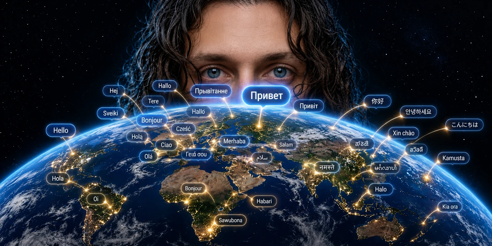

# YouTube Audio Translation



**Dub your video into other languages with an AI agent (Claude Code or Codex), keep the music, and upload
the result to YouTube as an extra audio track.**

The agent separates your voice from the music, transcribes the speech, **translates it phrase by phrase so
every phrase fits the time the original one had**, speaks it with a free voice, puts every phrase on the
exact second where the original phrase starts, mixes it with the original music and cuts the file to the
exact length of the video - which is what YouTube checks.

[Русская версия](README.ru.md)

## Use it with an agent

1. Install [Claude Code](https://claude.com/claude-code) or Codex, and clone this repo:

   ```bash
   git clone https://github.com/oknehcvark/youtube-audio-translation
   cd youtube-audio-translation
   ```

2. Put your video in the folder, start the agent there, and say:

   > Read `skills/youtube-audio-translation/SKILL.md` and dub `my-video.mp4` into French and Spanish.

   The agent installs what is missing (it asks first), runs the pipeline, translates the text itself and
   brings you `final.m4a` and a `.srt` for every language. (For Claude Code you can also copy
   `skills/youtube-audio-translation` into `~/.claude/skills/` and just ask for the dubbing.)

3. **Listen to the result**, ideally with a native speaker. The agent can measure the length and timing,
   but it cannot hear the audio.

4. YouTube Studio -> Subtitles -> add the language -> add the audio track (and the `.srt` as that
   language's subtitles).

## Without an agent

```bash
pip install -r requirements.txt            # numpy, soundfile, edge-tts, faster-whisper, pyrubberband
pip install "audio-separator[cpu]"         # only for splitting voice and music
D=skills/youtube-audio-translation/scripts/dub.py

python3 $D separate video.mp4 -o work                               # work/vocals.wav + work/music.wav
python3 $D transcribe work/vocals.wav --lang ru -o work/source.srt  # fix the mistakes by hand
python3 $D budget work/source.srt --lang fr                         # how many characters fit each phrase
#   write work/lines.fr.json: a JSON list with one translated string per phrase
python3 $D srt work/source.srt work/lines.fr.json -o work/fr.srt
python3 $D build work/fr.srt --ref video.mp4 --voice fr-FR-HenriNeural -o work/fr --loudness-ref work/vocals.wav
python3 $D mix work/fr/dub_only.wav --music work/music.wav --ref video.mp4 -o work/fr/final
python3 $D check work/fr/dub_only.wav work/fr.srt --lang fr --ref video.mp4
```

You also need the **ffmpeg** binary (4.4 or newer): `brew install ffmpeg`, `winget install ffmpeg`,
`apt install ffmpeg`. `rubberband` (`brew install rubberband`) is optional and gives nicer speed-ups.
Voices: `edge-tts --list-voices`.

## What the tool decides, and why

- **Phrases stand on the original seconds.** Each phrase is placed at the start time of the original phrase.
  Gluing phrases one after another makes the error grow until the end; this does not.
- **Fit before the next phrase.** If a spoken phrase is longer than the time it has, it is sped up (at most
  1.5x, with pitch kept). If it is clearly shorter, the voice is slowed a little instead (down to -20%), so
  the pace stays close to the original speaker.
- **A character budget per phrase** (`budget`) tells the translator how long a line may be. This is the main
  reason the result stays in sync: an automatic translator does not know it.
- **The length comes from the video.** A raw `.aac` has no length in its header, and `ffprobe` can be off by
  15 seconds; the tool decodes such files and takes the video as the reference.
- **Loudness** of the dub is matched to the original voice, the music is kept at its original level.

## Tested

On an 8 min 43 s review video (Russian speech with music), dubbed into four languages. Every phrase starts on
the original second, none spills into the next one, and each track has the exact length of the video. The
French track was accepted by YouTube. The speech recognizer re-read each dub:

| Language | Voice | Speed-up needed (max) | Re-read error |
|---|---|---|---|
| French | fr-FR-Henri | 1.05x | 3.5% WER |
| Spanish | es-MX-Jorge | 1.17x | 5.0% WER |
| Chinese | zh-CN-Yunxi | 1.14x | 14.1% CER (digits and Latin names) |
| Hindi | hi-IN-Madhur | 1.25x | 20.6% WER (spelling variants) |

The author did not listen to the Spanish, Hindi and Chinese tracks with a native speaker. Treat the numbers
as "the words are there and on time", not as a quality review.

## Limits

- The voices are stock voices, not your own voice, and there is one voice per track. Two speakers in the
  video are both voiced by the same voice.
- `edge-tts` uses Microsoft Edge's online voices without an official key: free, but unofficial, and it can
  change or stop working. It needs the internet.
- Tested on macOS (Apple Silicon). The code is cross-platform and the tests run on Linux, macOS and Windows,
  but the whole pipeline was not run on Windows or Linux.
- If `import scipy` crashes on macOS (a `dlopen` error) while installing `audio-separator`, use
  `pip install scipy==1.14.1`.
- Dub only videos you own or have the right to translate.

## Tests

```bash
pip install numpy soundfile pytest
pytest -q
```

They cover the timing logic (placement, speed-up, slow-down, phrase grouping, subtitles, error rate) and
need no network, models or media.

## License

MIT
